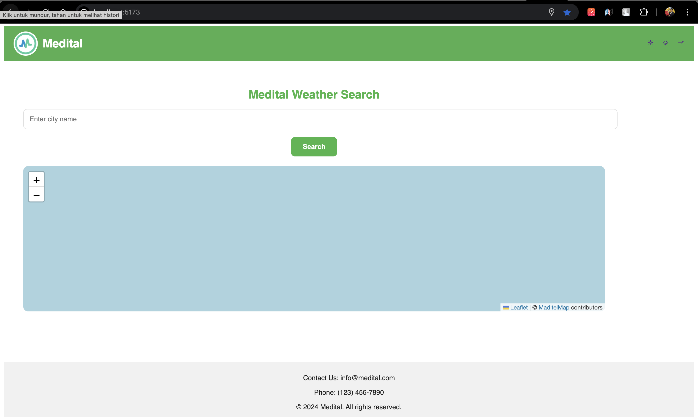
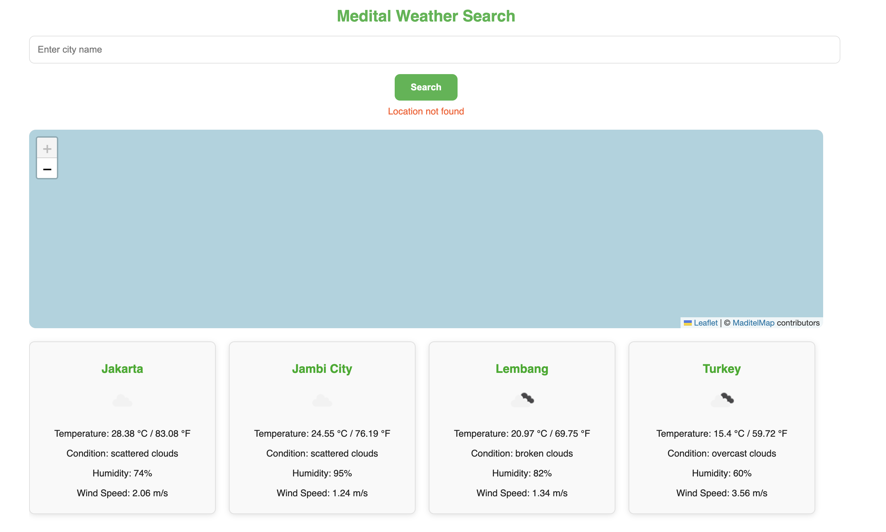

# MEDITAL Weather Search Page

## Introduction

This project is a single-page web application that allows users to search for weather information for a specific location using the OpenWeather API. The application focuses on user experience and visual appeal.

## Installation and Setup

### 1. Clone the repository:

Clone the repository by running the following command in your terminal:
```json
git clone https://github.com/fitramelaniarais/Medital.git
```
### 2. Go to app

Go to wather-search-app by copying
```json
cd weather-search-app
```

### 3. Install dependencies:

After cloning the repository, navigate to the project directory in your terminal and run the following command to install the required dependencies:
```json
npm i
```

### 4. Run the proggram

Run the proggram by copying this code
```json
npm run dev
```

### 5. PORT

Open this following port
```json
http://localhost:5173/
```

### 6. Add API-KEY

Add your own API-KEY in .env file. You can see the .env.example for the key name.
```json
VITE_OPENWEATHER_API_KEY=
```
or if dont have api-key just use mine
ac7e941a35e89453122ff41bd32ea045

### Example screenshot : 




## Functional Requirements

### 2.1 Search Functionality:
- [v] The page features a prominent search bar where users can enter the name of a city or location.
- [v] The search can be triggered by pressing the "Enter" key or clicking a dedicated search button.
- [v] The application handles invalid or empty search inputs gracefully, providing appropriate feedback to the user.

### 2.2 Weather Data Display:
- [V] Upon a successful search, the application retrieves weather data from the OpenWeather API for the specified location.
- The displayed weather information includes:
  - [V] Current temperature (in Celsius and Fahrenheit)
  - [V] Weather condition (e.g., Sunny, Cloudy, Rainy)
  - [V] Humidity
  - [V] Wind speed
  - [V] An icon representing the weather condition
- [V] The data is presented in a clear, visually appealing format, using cards, tables, or other UI elements.

### 2.3 Error Handling:
- [V] The application gracefully handles errors that may occur during the API call (e.g., invalid API key, location not found).
- [V] Error messages are informative and user-friendly.

## API Integration
- [v] The application utilizes the OpenWeather API to retrieve weather data.
- [V] An API key is required (obtainable from OpenWeather).
- [v] API calls are made using appropriate HTTP methods (e.g., GET).
- [v] The application handles different response codes from the API and displays appropriate messages to the user.

## Creative Design Elements
- [v] The application features creative and appealing design elements.

## Technical Requirements
- [v] The application is developed using React as the front-end framework.
- [v] The code is well-structured, documented, and easy to maintain.

## Testing
- [v] Thorough testing is conducted to ensure the application functions correctly and handles different scenarios (valid/invalid inputs, API errors, etc.).

## Development Environment Setup and Running the Application

### 7.1 Zero-Environment Approach
- [v] The application is runnable without requiring users to have a pre-configured development environment.
- Clear and step-by-step instructions are provided for setting up the necessary environment from a completely clean slate, including:
  - [v] Installing Node.js and npm (or yarn)
  - [v] Installing project-specific dependencies using a package manager (npm or yarn)
  - [v] Instructions on running a development server (if applicable)

### 7.2 Detailed Setup Instructions
- [v] A dedicated section outlines the entire process, from installing basic tools to running the application locally.
- [v] Instructions are broken down into small, manageable steps with clear explanations.
- [v] Screenshots or screen recordings are included to aid visual learners.
- [v] Instructions consider different operating systems (Windows, macOS, Linux) and provide platform-specific details.

### 7.3 Example Setup Instructions
1. **Install Node.js and npm**: Download and install Node.js from the official website [https://nodejs.org/](https://nodejs.org/). This will also install npm.
2. **Navigate to Project Directory**: Open your terminal or command prompt and navigate to the root directory of the project.
3. **Install Dependencies**: Run the command `npm install` to install all project dependencies listed in the `package.json` file.
4. **Start Development Server**: Run the command `npm run dev`. This will start a local development server and open the application in your default web browser.

## Submission
- Submission is via a GitHub repo link to Glints.id chat to the employer.

Good luck!
